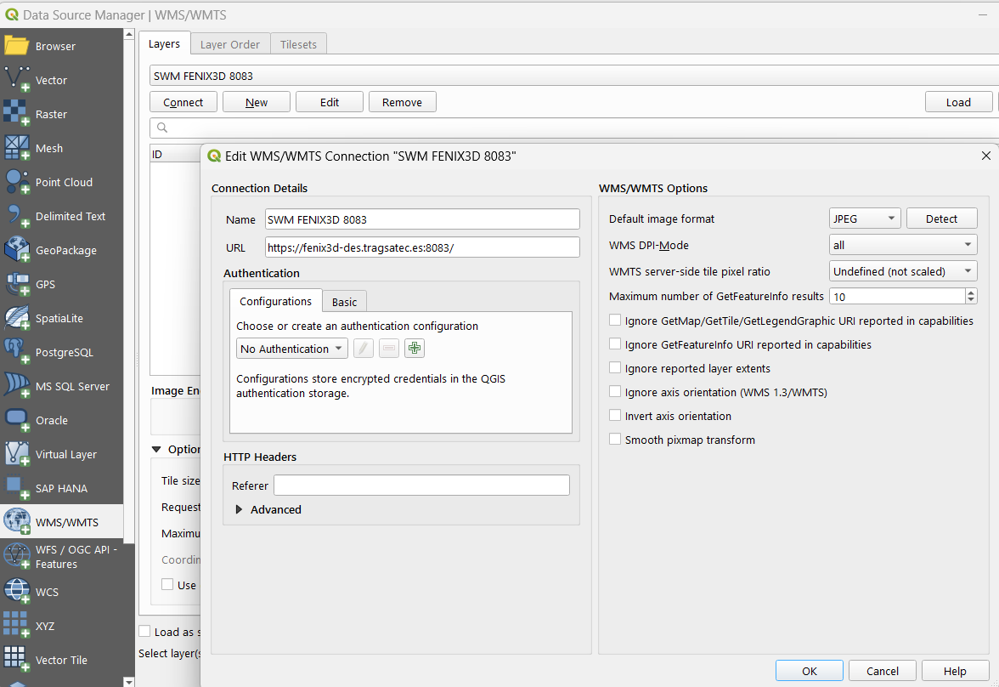
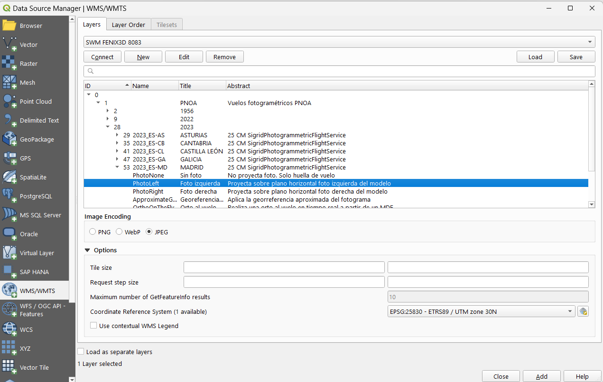
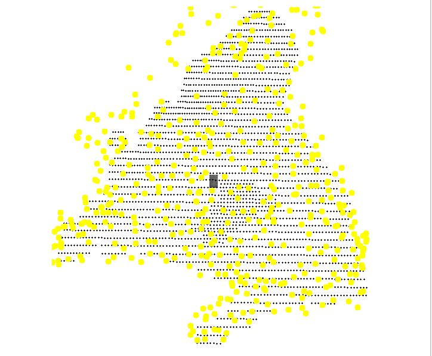
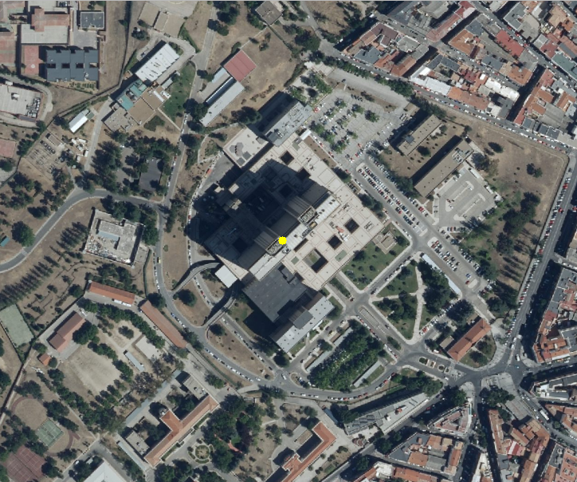
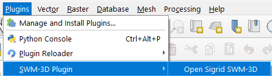
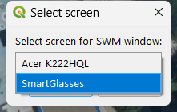
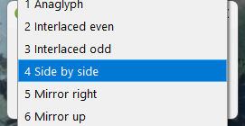

***
# SIGRID_SWM_3D - QGIS Plugin - Version 0.5.1

**Status:** Active development  
**Scope:** Stereoscopic visualization of SWM photogrammetric flight WMS services in QGIS 4.x  
**Documentation language:** English ([readme.md](readme.md))

## Table of Contents

1. [Description](#1-description)
2. [Requirements](#2-requirements)
3. [Installation and/or updating](#3-installation-andor-updating)
4. [Quick Start](#4-quick-start)
5. [Changes](#5-changes)
6. [Troubleshooting](#6-troubleshooting)
7. [Known Issues](#7-known-issues)
8. [Future work](#8-future-work)
9. [Compatibility Matrix](#9-compatibility-matrix)
10. [Visual Walkthrough](#10-visual-walkthrough)

## 1. Description

**SIGRID_SWM_3D** is a QGIS plugin for visualizing **StereowebMap® photogrammetric flight WMS services** content, in stereoscopic mode.

The plugin renders the stereoscopic pair in a secondary window synchronized with the main QGIS canvas. All navigation and tools are controlled from the main window and reflected in the stereo view in real time.

Use **ALT + mouse wheel** in the main window to adjust the **cursor Z** value, which is immediately reflected in the stereoscopic visualization. Each mouse-wheel step moves the cursor up or down by 1 meter. To move the cursor by 10 meters, press and hold **ALT + SHIFT + mouse wheel**. To move the cursor by 0.1 meters, press and hold **ALT + CTRL + mouse wheel**.

---

## 2. Requirements

### 2.1 Mandatory
- **QGIS 4.x** (based on Qt 6).  
- **Windows** operating system.
- **Two or more monitors**.

### 2.2 Recommended
- One of the monitors should support stereoscopic system.
- Access to the SWM photogrammetric WMS service. Currently available endpoints: 
- **If you are working on an intranet, change 'https://' to 'http://'**
  - https://fenix3d-des.tragsatec.es:8083/ (testing)
  - https://fenix3d-des.tragsatec.es:8084/ (development)

## 3. Installation and/or updating
- Menu path: Plugins -> Manage and Install Plugins -> Install from ZIP -> ZIP file.
- Use the ZIP package of the latest plugin version: *sigrid_stereowebmap_3D_x_x_x.zip*.
- Have access configured to a StereoWebMap service

## 4. Quick Start

1. Install the plugin from ZIP in QGIS.
2. Load the required layers into the main window. One of them must be a **StereowebMap® photogrammetric flight WMS** service. Example: https://fenix3d-des.tragsatec.es:8083/
3. Launch the plugin and open the stereo window on a second monitor. If you have more than two monitors, it will ask you which one to open the photogrammetry window on. If you only have two, it will open it directly on the monitor where QGIS is not open.
4. Select stereo mode: Anaglyph, Interlaced, side by syde, Mirror right, Mirror up.
5. Navigate in the main QGIS canvas (pan, zoom, tools).
6. Adjust cursor depth with **ALT + mouse wheel**.

Expected behavior:
- Main canvas and stereo window remain synchronized.
- Depth adjustments are shown dynamically in the stereo view.

## 5. Changes

### Version 0.5.1
- Prevent the cursor from entering the photogrammetric window.
- Translate all code comments into English.
- Improve this README document.

### Version 0.5.0
- Reorganization of existing classes into a file structure that better reflects the script architecture, with clearer separation of components and responsibilities.  
  Guiding principles:
  - Consistency
  - Robustness
  - Scalability
  - *QGIS-native* approach
  - Long-term maintainability

- Code adapted to **Qt 6**, the new standard in **QGIS 4**.  
  Although this is not the current LTR release, **SWM-3D** development targets this version,
  which is expected to become LTR in the future. The improvements introduced in the Qt 6
  libraries justify this decision.

- Introduction of additional error handling to prevent unexpected *crashes* and  
  ensure that failures are reported explicitly and in a controlled manner.

---

## 6. Troubleshooting

### Plugin does not appear in QGIS
- Verify you are using **QGIS 4.x**.
- Reinstall from the latest plugin ZIP package.
- Check that plugin installation is enabled in QGIS Plugin Manager.

### Stereo window does not update
- Confirm all interaction is performed in the main QGIS window.
- Ensure the secondary monitor is active and visible to the OS.
- Check that the selected WMS service is reachable.

### No stereoscopic effect is visible
- Verify your display hardware supports stereoscopic output.
- Confirm your monitor or display pipeline is configured for stereo mode.

### Cursor Z changes are not reflected
- Use **ALT + mouse wheel** over the main canvas.
- Ensure the stereo window is open and synchronized.

---

## 7. Known Issues

### Overlay Stereo Modes Not Working
- Currently, stereo modes based on overlaying the two images (left and right) with transparency are not working: anaglyph and interlaced stereo.

### Vector Layer Overlay with Z
- This functionality has not yet been fully implemented and debugged.
- PointZ and MultiPointZ entities are causing problems.
- For linear and polygonal entities, it sometimes fails when the first model is loaded. After that, it seems to work correctly.

### Duplication of map canvas items from the main canvas to stereoscopic canvases
- This duplication is experiencing problems.
- Sometimes excessive delay is observed.
- In map canvas items with a Z value per vertex, items are often not replicated and captured correctly.

### Stereoscopy is less clear for flights that are not east-west passes
- Because the images are rotated, stereoscopy is not clearly visible in these cases.
- The ability to rotate images horizontally must be implemented to overcome this limitation.

### The SWM server is experiencing problems with the quality of JPEG images.
- The JPEG images are being served in very low quality.
- Request the images from the StereoWebMap server in **png** format 

---

## 8. Future work

The most immediate developments from this baseline version are:

- Correct the issues pointed out in the previous section.
- Test and refine the stereoscopic rendering on different hardware setups, especially the dual-screen with a 45-degree mirror.
- Add visualization support for **anaglyph** and **interlaced horizontal lines** systems.
- Begin incorporating delineation tools that work directly on the stereoscopic views.

---

## 9. Compatibility Matrix

| Component | Supported | Notes |
|---|---|---|
| QGIS | 4.x | Based on Qt 6 |
| Operating system | Windows | Primary target platform |
| Monitor setup | 2+ monitors | One monitor can be stereo-capable |
| Stereo hardware | Recommended | Required for full stereoscopic experience |
| SWM WMS endpoints | Required | Testing and development endpoints listed above |

---

## 10. Visual Walkthrough

### Configure StereoWebMap Service Connection

### Add WMS StereoWebMap Layer

### Result main canvas

### Zoomed area main canvas

### Throw Sigrid StereoWebMap Plugin
]

### Select Stereo Screen (only if more than two displays)

### Select Stereo Mode

### Stereo Windows Result

***

**End of readme.md**