# SIGRID_SWM_3D - QGIS Plugin - Version 0.7.4

**Status:** Active development
**Scope:** Stereoscopic visualization of SWM photogrammetric flight WMS services in QGIS 4.x (stability target: QGIS 4.2 stable)
**Documentation language:** English ([readme.md](readme.md))

## Table of Contents

1. [Description](#1-description)
2. [Requirements](#2-requirements)
3. [Installation and/or updating](#3-installation-andor-updating)
4. [Quick Start](#4-quick-start)
5. [Changes](#5-changes)
6. [Troubleshooting](#6-troubleshooting)
7. [Known Issues](#7-known-issues)
8. [Future work](#8-future-work)
9. [Compatibility Matrix](#9-compatibility-matrix)
10. [Visual Walkthrough](#10-visual-walkthrough)
11. [License](#11-license)
12. [Authors and Contributors](#12-authors-and-contributors)
13. [Technical notes](#13-technical-notes)

## 1. Description

**SIGRID_SWM_3D** is a QGIS plugin for visualizing **StereowebMap® photogrammetric flight WMS services** content in stereoscopic mode.

The plugin renders the stereoscopic pair in a secondary window synchronized with the main QGIS canvas. All navigation and tools are controlled from the main window and reflected in the stereo view in real time.

Use **ALT + mouse wheel** in the main window to adjust the **cursor Z** value, which is immediately reflected in the stereoscopic visualization. Each mouse-wheel step moves the cursor up or down by 1 meter. To move the cursor by 10 meters, press and hold **ALT + SHIFT + mouse wheel**. To move the cursor by 0.1 meters, press and hold **ALT + CTRL + mouse wheel**.

---

## 2. Requirements

### 2.1 Mandatory

- **QGIS 4.0 or higher** (based on Qt 6).
- **Windows** operating system.
- **Two or more monitors**.

### 2.2 Recommended

- **QGIS 4.2 stable** as the preferred production baseline.
- One of the monitors should support stereoscopic system.
- Access to the SWM photogrammetric WMS service. Currently available endpoints:
- **If you are working on an intranet, change 'https://' to 'http://'**
  - [https://fenix3d-des.tragsatec.es:8083/](https://fenix3d-des.tragsatec.es:8083/) (testing)
  - [https://fenix3d-des.tragsatec.es:8084/](https://fenix3d-des.tragsatec.es:8084/) (development)

## 3. Installation and/or updating

- Menu path: Plugins -> Manage and Install Plugins -> Install from ZIP -> ZIP file.
- Use the ZIP package of the latest plugin version: *sigrid_stereowebmap_3D_x_x_x.zip*.
- Configure access to a StereoWebMap service.

## 4. Quick Start

1. Install the plugin from ZIP in QGIS.
2. Load the required layers into the main window. One of them must be a **StereowebMap® photogrammetric flight WMS** service. Example: [https://fenix3d-des.tragsatec.es:8083/](https://fenix3d-des.tragsatec.es:8083/).
3. Launch the plugin and open the stereo window on a second monitor. If you have more than two monitors, it will ask you which one to open the photogrammetry window on. If you only have two, it will open it directly on the monitor where QGIS is not open.
4. Select stereo mode: Anaglyph, Interlaced, side by side, Mirror right, Mirror up.
5. Navigate in the main QGIS canvas (pan, zoom, tools).
6. Adjust cursor depth with **ALT + mouse wheel**.

Expected behavior:

- Main canvas and stereo window remain synchronized.
- Depth adjustments are shown dynamically in the stereo view.
- Modified oblique flight logic. Angle oblique passes with a prior WMS request using the default style.

## 5. Changes

### Version 0.7.4

- Solved problem of stereo canvas window limitations in the case of oblique flights. ***To rotate the canvas for oblique flights, the *Rotate Canvas Level* parameter must be set to a value greater than 0***.
- Flight issue with rotated camera mount resolved.
- Anaglyph mode overlap issues resolved.
- Reorganized plugin bar parameters and options.
- Hardened plugin startup and shutdown when a QGIS project is already loaded. Project, canvas, network, and canvas-item synchronization are now gated by a startup/shutdown semaphore so the stereo canvases are populated only after the plugin window is fully constructed.

### Version 0.7.3

- Plugin toolbox problems resolved.

### Version 0.7.2

- Included beamsplitter stereo mode.
- Forces to redraw stereo canvases every time settings (parameters or checkboxes) change

### Version 0.7.1

- Included in the plugin toolbar drop-down lists for configuration parameters and checkboxes.
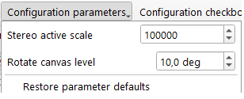
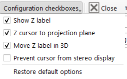

### Version 0.7.0

- Layer visibility scaling has been incorporated. Visibility by scaling is adjusted in stereo canvases to match that of the main canvas.
- Added taskbar with plugin-specific controls: Stereo activation scale, canvas rotation threshold, and labels with current canvas rotation, terrain Z, and cursor Z values. The latter two were moved from the QGIS status bar.
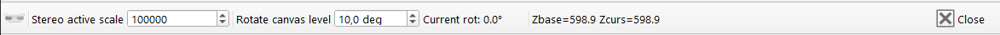
- North indicator inserted in case of canvas rotation.
- Highlighted SWM service layers and double checkbox in layers. The one on the left controls visibility in stereo canvases and the one on the right in the main canvas.
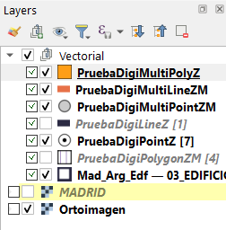

### Version 0.6.4

- Fixed error where alt + mouse wheel fails the next few times the plugin is opened

### Version 0.6.3

- Fixed error of repeated duplicate requests to the SWM service
- Fixel error drawing in stereo canvas multipolygons

### Version 0.6.2

- Fixed bug with overlapping stereos (anaglyph and interlaced)
- Fixed issue with oblique flights. When the pass angle (α) exceeds 10º, all canvases (stereo and main) are rotated -αº
- A minimum scale (1/100,000) is set for 3D projection on stereo canvas. 3D projection is not applicable for smaller scales.

### Version 0.6.1

- Incorporated overlapping stereos (anaglyph and interlaced).
- Automatic transmission of symbology changes to the stereo canvases.
- Visible-invisible switching on main canvas

### Version 0.6.0

- Corrected vertex displacement in polyline.
- Automatic transmission of symbology changes to the stereo canvases.
- Visible-invisible switching on main canvas instantly reflected on stereo canvas
- Fixed drawing issue with main canvas boundaries in stereo canvases
- Corrected text of Z not reflected in stereo canvas where appropriate.
- Cloning Map Canvas Items from the main canvas to the stereo canvases.
- Verification of proper functioning of QGIS digitization tools on stereo canvases with correct capture and display of Z
- Solved problem of drawing connection lines in the case of multiple figures (points, lines or polygons).

### Version 0.5.1

- Prevent the cursor from entering the photogrammetric window.
- Translate all code comments into English.
- Improve this README document.

### Version 0.5.0

- Reorganization of existing classes into a file structure that better reflects the script architecture, with clearer separation of components and responsibilities.
  Guiding principles:
  - Consistency
  - Robustness
  - Scalability
  - *QGIS-native* approach
  - Long-term maintainability
- Code adapted to **Qt 6**, the new standard in **QGIS 4**.
  Although this is not the current LTR release, **SWM-3D** development targets this version,
  which is expected to become LTR in the future. The improvements introduced in the Qt 6
  libraries justify this decision.
- Introduction of additional error handling to prevent unexpected *crashes* and
  ensure that failures are reported explicitly and in a controlled manner.

---

## 6. Troubleshooting

### Plugin does not appear in QGIS

- Verify you are using **QGIS 4.x**.
- For production/stability-sensitive use, prefer **QGIS 4.2 stable**.
- Reinstall from the latest plugin ZIP package.
- Check that plugin installation is enabled in QGIS Plugin Manager.

### QGIS crashes when launching the plugin with an existing project loaded

- This startup path has been hardened in version 0.7.4. The plugin now keeps project/canvas interaction locked while its window and stereo canvases are being constructed, then synchronizes the already loaded project in one controlled pass.
- The protection covers project/canvas signals, network replies, scene item synchronization, and shutdown cleanup. It does not rely on startup delay timers.
- If a crash still occurs, capture the QGIS crash report and the **SWM-3D** log panel contents, then retry with a project opened after launching the plugin to confirm whether the failure is still tied to already loaded project state.

### Stereo window does not update

- Confirm all interaction is performed in the main QGIS window.
- Ensure the secondary monitor is active and visible to the OS.
- Check that the selected WMS service is reachable.

### No stereoscopic effect is visible

- Verify your display hardware supports stereoscopic output.
- Confirm your monitor or display pipeline is configured for stereo mode.

### Cursor Z changes are not reflected

- Use **ALT + mouse wheel** over the main canvas.
- Ensure the stereo window is open and synchronized.

---

## 7. Known Issues

### The last segment is not visible in the stereo canvases during line and segment digitization tasks

- This segment connects the last digitized vertex to the cursor position and is visible in the main canvas but not in the stereo canvases.
- It could not be implemented in the stereo canvases because its handling is contained within QGIS's C++ code and is not accessible from Python. This is a purely graphical feature, so it was decided not to include it in the stereo canvases because it would complicate the stability and ease of tracking of the plugin's code.

### The SWM server is experiencing problems with the quality of JPEG images

- The JPEG images are being served in very low quality.
- Request the images from the StereoWebMap server in **png** format instead of JPEG.

---

## 8. Future work

---

## 9. Compatibility Matrix

| Component | Supported | Notes |
| --- | --- | --- |
| QGIS | 4.x | Compatible on 4.x; stability target is 4.2 stable. Validated manually on 4.0, 4.1, 4.2; verify 4.3 regressions when needed |
| Operating system | Windows | Primary target platform |
| Monitor setup | 2+ monitors | One monitor can be stereo-capable |
| Stereo hardware | Recommended | Required for full stereoscopic experience |
| SWM WMS endpoints | Required | Testing and development endpoints listed above |

---

## 10. Visual Walkthrough

### Configure StereoWebMap Service Connection

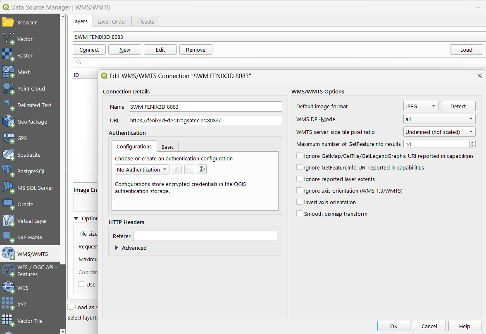

### Add WMS StereoWebMap Layer

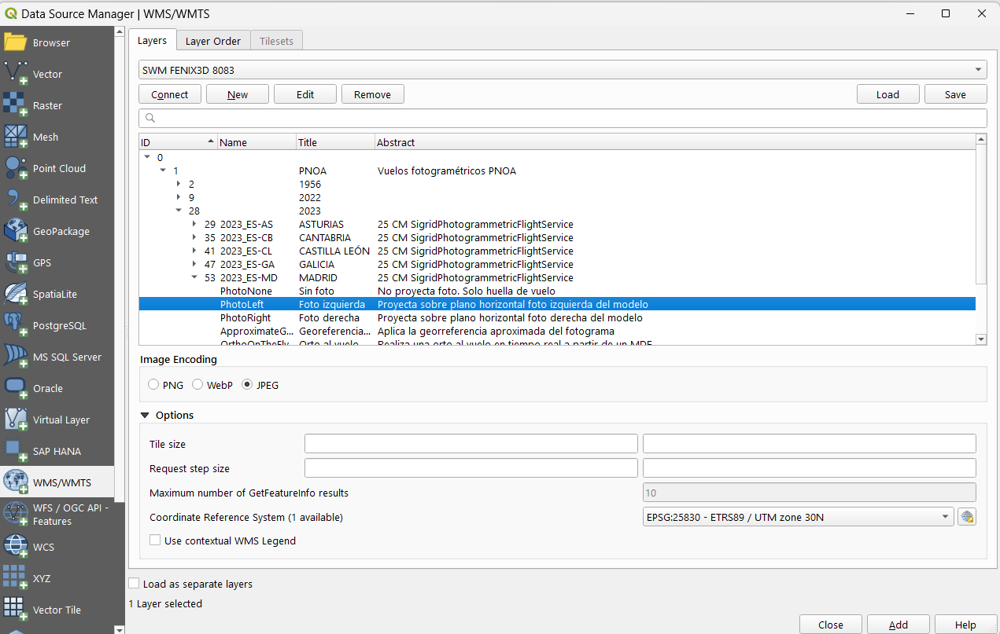

### Result main canvas

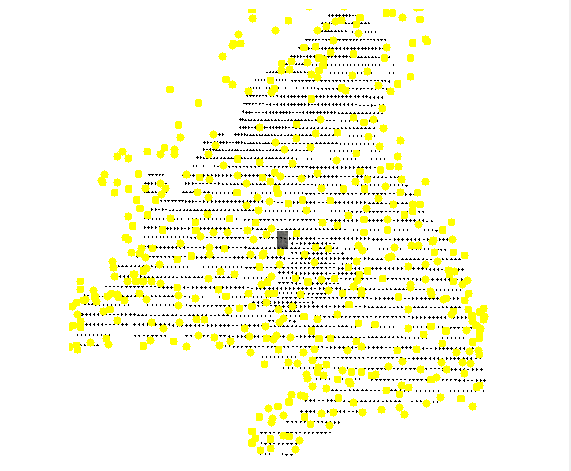

### Zoomed area main canvas

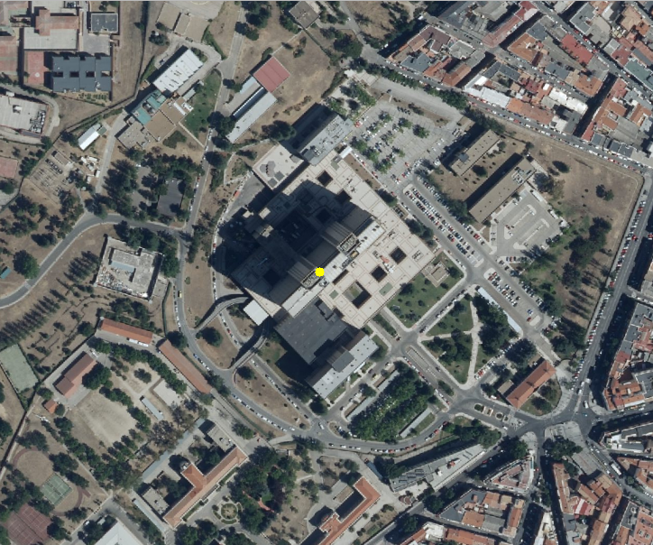

### Throw Sigrid StereoWebMap Plugin

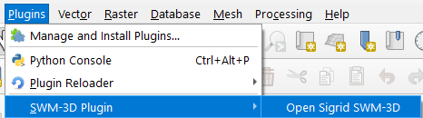

### Select Stereo Screen (only if more than two displays)

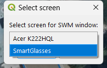

### Select Stereo Mode

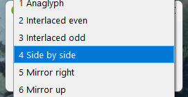

### Stereo Windows Result

---

## 11. License

This plugin is provided under the terms of the LICENSE file included in this repository. For more information, see [LICENSE](LICENSE).

---

## 12. Authors and Contributors

**Main Authors:**

- Conrado Sánchez López ([conradosanchez@sigrid.es](mailto:conradosanchez@sigrid.es))
- Javier Herrero
- Tragsatec

**Repository:** [https://github.com/conradosigrid/sigrid_stereowebmap_3D](https://github.com/conradosigrid/sigrid_stereowebmap_3D)
**Issue Tracker:** [https://github.com/conradosigrid/sigrid_stereowebmap_3D/issues](https://github.com/conradosigrid/sigrid_stereowebmap_3D/issues)

## 13. Technical notes

### 13.1 Rendering paths and regression checks

This plugin uses two different geometry paths, and they do not behave the same internally.

Path A: layer rendering (QGIS renderer + expressions)

- Used for normal map layers.
- QGIS applies the renderer pipeline, including Geometry Generator expressions.
- Geometry structure (multipart, rings, holes) is handled by the layer rendering engine.

Path B: canvas items (rubber bands, vertex markers)

- Used for interactive temporary items from tools.
- These are not rendered by the layer renderer pipeline.
- The plugin clones/transforms geometry directly in Python before assigning it to the stereo canvases.

Why explicit ring/part handling is required in Path B

- A MultiPolygon is not just a list of points; it is a set of polygon parts, each with one outer ring and optional inner rings.
- If vertices are flattened into one sequence, the last vertex of one part can be connected to the first vertex of another part.
- The visible effect is a false bridge line between polygons (same risk for multiline/multipoint shape integrity).

What a regression test means here

- A regression test is a permanent check to ensure a fixed bug does not return later.
- In this project, the multipart regression check verifies that transformed output keeps:
  - MultiPoint as multi-point with same part count.
  - MultiLineString as multi-line with independent parts.
  - MultiPolygon as multi-polygon without bridge segments between parts.

### 13.2 Geometry structure

*Reserved for future notes about multipart geometry handling, ring preservation, and related rendering details.*

### 13.3 Regression checks

*Reserved for future notes about manual smoke tests, reproduction steps, and validation checks.*
